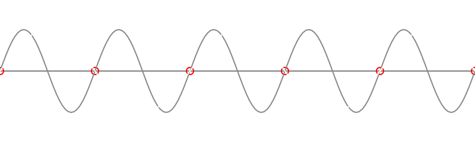
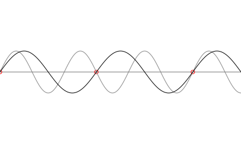
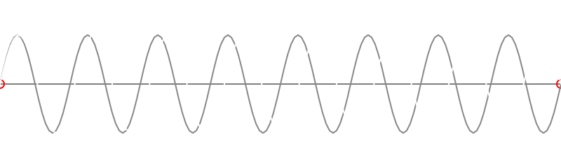
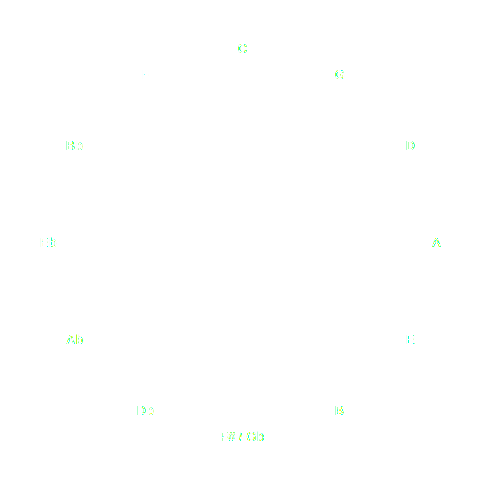

# Music Theory For Worshippers

## Introduction

Hey there, you're probably here because you love Jesus and you love worshipping him.
Maybe you know how to play the guitar or the piano, or not.
Maybe you're a beginner or you know your instrument well.
You're probably thinking music theory, pff, that's boring, that's complex, that's dry, but I have good news for you.
Music theory can actually be really fun and it can help you improve and simplify your playing a lot and free up some space in your head while worshipping.
The less you have to think while playing, the more focus you can have on actually worshipping and that's what we want, right?
Therefore I think everyone benefits a lot from some basic understanding of how music works.
And I have good news for you, contemporary worship music is simple, yes it's really deliberately simple.
It's so simple it even feels dull to do when you know how complex other music can be.
But why is this so?
The music should support you in worshipping and get out of your way.
Your focus should be to give all the glory to Jesus, to pour out your heart before him, to stand in awe and adoration before him and to surrender to his good plan for you and your life.
Music is a gift that can help you express that and the bar should be as low as possible for everyone to join in and participate.
I know we can praise him with complex music as well, it's a gift as well and there is so much beauty in it.
If I hear the masterpieces of the ancient composers, my heart opens up and praises God for such beauty, but in this music not everyone can easily join in.
Therefore I'm glad that we have this stripped-down contemporary worship music, which in its simplicity has a lot of beauty as well and is very well suited for worshipping all together.

And since the music is simple and the bar should be low for everyone to join in, the same should hold for this course.
So if you want a comprehensive course of all the facets of music and learn music theory the hard way, like I did, go and read a book of a few thousand lines.
If you are a nerd like me, you probably have some fun in doing so, but for all the others I want to break it down to the most simple and most basic concepts you need to know, so that it should be easy to follow for everyone.

My name is Felix and one thing you'll quickly realize about me: I'm a little nerd, you will probably notice at a few places within this course.
I studied computer science and therefore do think a bit mathematical from time to time.
I've learned music theory the hard way practicing all the scales, cadences, harmonies and much more like realtime harmonizing old hymns etc. while learning to play the organ.
And it was quite a challenge for me to switch from doing that complex stuff to the simplicity of contemporary worship music without overdoing it.
The simple patterns I will show you helped me a lot in staying inside that simplicity.
So if you are a classical pianist, organist, or whatever your background, this course is for you as well.
You're just like me, coming from the other side.
Let's all meet in the middle.

In this course you will learn how to play nice and easy chords without thinking about it too much.
You probably saw chords like `F#m7add11` and thought what the heck, I'm not playing this.
If you follow this course, you will and you won't even notice.
I will introduce you to contextualized chords, where you don't have to think of any extensions, I mean that `7add11` stuff, because it will arise naturally without any thinking.
You will play nice chords and sound like a pro with much more depth and color and fullness within your chords and playing and it will get simpler as well.
I know this sounds too good to be true, but it enabled even me to play the guitar, and I'm not that good at bending my fingers.
And it helped me to play without much mental effort so you can fully focus on worshipping.
So let's get started.

## Chapter 0 Technical Background

Ever wondered why music theory is how it is, what a tone is and why we have twelve of them (twelve equal steps per octave)?
No?
That's completely fine.
Feel free to skip this chapter and start with the real stuff.
But if you're interested and have a few minutes I encourage you to read through it.
You don't have to remember everything or even completely understand everything.
But within the technical background of how music works there is so much beauty God put in, that we can discover, even though we only scratch the surface.
The theory how music works is nothing we have created, but we have discovered it.
It's beauty baked into the core physics of our world, wonderfully crafted.
And we can use it to take pleasure in it and praise god with it.

### The two dimensions of a tone

So what is a tone?
It's like everything that is, it's a wave.
Something that moves back and forth.
For example if you pull on a string on your guitar, or press a key on the piano, a string moves back and forth.
That string moves the air back and forth until it reaches your ear, then some parts in your ear move back and forth, and your brain translates it to something that we call a sound we can hear.
Isn't that stunning?
And there are two dimensions to it.
How strong or wide it moves, which defines how intense and how loud the sound is, and how fast it moves, which defines how low or high the sound is.
That's why when you pull hard on the string it becomes louder and if you make the string shorter, or if you tighten the string more, it moves faster and therefore becomes higher.

### It's all about color

In music theory we only focus on the second dimension, how high it is.
And in physics we measure it by how often it moves back and forth per second.
For example if you pull your second string on the guitar, the A string, it vibrates about 110 times per second in standard tuning, and we call the frequency 110 Hz.
So we have indefinitely many tones we can technically produce, everything from 0 Hz to infinity.
But not everything we can hear.
Most people can hear roughly between 20 Hz and 20 kHz (it varies with age and the individual).
The range of a 88 key piano goes from 27,5 Hz up to 4.19k Hz.
A guitar is much more limited, it goes from 82.4 Hz up to 1.39k Hz.
But still in each of these ranges there is an infinite number of tones, because you can put as many digits after the period if you want, but at some point we are no longer able to distinguish it.

### Making the continuous scale discrete

But with such a continuous scale it's pretty hard to do theory with.
It's hard enough to do theory with the twelve equal pitch steps we use in modern music, but it's impossible to do it with an infinite amount.
So we just randomly pick twelve frequencies and define that this are our tones?
That's exactly how many people think, but it's not random, it's designed into the core of physics, and to understand that we have to look into why a guitar sounds different than a piano, why a trumpet sounds different than a violin?
Isn't it so that if I play the same tone on each of these instruments they have the exact same frequency?
And I even can play them with the same intensity, so they have the same volume?
That's right, but why do they sound different?

### Overtones or Harmonics
 
The answer is that a frequency almost never comes alone, it has some other frequencies that belong to it, that are backed into physics.
These are called harmonics or overtones.
So if you play a tone on any instrument, not only the base frequency of this tone is produced, but also an infinite amount of higher frequencies is produced, and the intensity of these higher frequencies defines the color of the tone.
Listen to how those overtones show up as different "colors" in practice:

**Sine wave (pure tone)**
([sine.wav](./sine.wav))

**Piano tone**
([piano.wav](./piano.wav))

**Guitar tone**
([guitar.wav](./guitar.wav))

And that's why different instruments sound different, they have a different color, because their overtones are different.
And the same effect which gives the tone itself color through the overtones is the effect we use in music theory to combine tones to create color.
So we have to understand the overtones and what creates the color, to create color ourselves.
I know now it gets really nerdy and I hope that you are still with me.

### The first simplification: Octaves are the same

The first overtone/harmonic has just double the frequency.
You can see it within the following picture.

It's the points where the waves don't align that bring color.
If you have double the frequency, they do align on every zero point of the base frequency, that is boring, that is almost no color.
It's so boring that we even consider it the same tone in music theory.
That's why on your piano every white key before the two black keys is called C, even though it is a different tone.
The span between these two frequencies is what we call an octave.
And now we notice the first simplification we make in music theory.
If we consider every octave to a tone the same.
So, we only have to focus on one octave, because after that everything is just repeating.

But now we want some color, but the least amount of it.
The next simple ratio we meet is 3:2, which corresponds to a perfect fifth.
When you compare the waves for those two frequencies, the zero-crossings line up fairly often, but not as perfectly as in the octave, so it still sounds relatively pure.
And you can see it within the next picture.

This interval we call a fifth.
(For the ultimate nerds under us: it comes from comparing harmonics, but since we treat octaves as the same tone, you hear it as a fifth relative to the root :)).

We could go on like this forever and discover the whole family of simple intervals, but since you are probably already bored and I don't want to waste your time, we stop here; you see the pattern.
The interval with the sharpest color we know is the small second.
In the "pure" model this corresponds to the frequency ratio 16:15 (a minor second), which is exactly what the picture shows.

### The second simplification: Equidistant Semitones

From those overtones/harmonics we can build a picture of "pure" intervals like octaves (2:1), perfect fifths (3:2), and the small second (16:15).
But here's the problem: if you want those simple ratios, you can't also make every key perfectly work at the same time.

So we make another simplification: we divide the octave into twelve equal steps (semitones).
In 12-tone equal temperament, each semitone step has the frequency ratio 2^(1/12) (about 1.05946).
That means the "minor second" is close to 16:15, but not exact, so no key is perfectly in tune, yet all keys are equally usable.

### The Circle of Fifths

With this simplification we get something cool, because we can just use the fifth and repeat it to get around each of the 12 pitch classes, and after that it repeats.
Which is called the famous circle of fifths.

### Some Takeaways

Now we know why we have our twelve tones (pitch classes) per octave in the modern system.
And the key takeaways are that we have twelve equidistant tones (officially called semitones) that do fill one octave and do repeat afterwards.
They themselves have some color by the fact that they do have overtones/harmonics.
And we can use the physics of musical color God created deeply into physics to create color and therefore beauty with it.

## Chapter 1 Scales

## Chapter 2 Chords

## Chapter 3 Context

## Chapter 4 Application Piano

## Chapter 5 Application Guitar

## Chapter 6 Chord Progressions

## Chapter 7 Crazy Chords

## Chapter 8 Experimenting with Context
